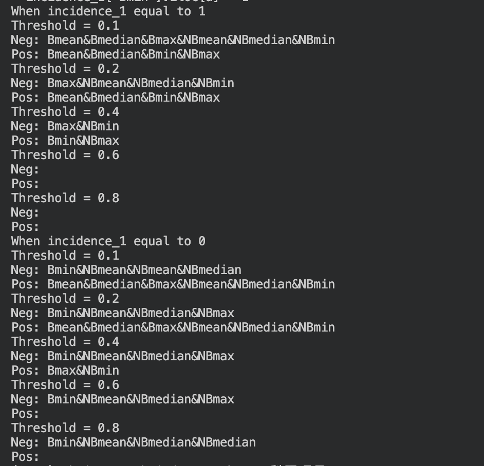



I interested in using technology to solve real-life problems 

Network Data Camouflage

When I was in high school, I am intersted in Virtual Private Network. The Trojan is particularly popular encryption protocols at that time. I use IaaS to be a site and disguise transmission data as video format. After that, I optimize and customize software client in different platform mostly in linux and its derivative system becasue of inaccurate identification of data diversion. 

Network Performance Optimization
In spare time of college, I was intersted in optimizing LAN performance. At the time when WIFI6 was being commercialized, I searched many technical document related to technical details such as MU-MIMO, OFDMA. The transmission of LAN is limited by the network equipment proformance and non-customization, that's how I got in touch with using sigle-chip machine or PC to be the customized network devices. In customized software-based router, because of mutiple system conflict, schedule and cooperation, I was addicted to it. Moreover, I created a personal video library and file sharing system based on Network Attached Storage to make fun from network. 

 

https://github.com/chriswong-6/Homepage.github.io/blob/master/_pages/11.png
_pages/11.png

# Network Performance Optimization
<!-- * Summer 2015: Research Assistant
  * Github University
  * Duties included: Tagging issues
  * Supervisor: Professor Git

* Fall 2015: Research Assistant
  * Github University
  * Duties included: Merging pull requests
  * Supervisor: Professor Hub -->
  
Skills
======
* Skill 1
* Skill 2
  * Sub-skill 2.1
  * Sub-skill 2.2
  * Sub-skill 2.3
* Skill 3

Publications
======
  <ul>
    
  </ul>
  
Talks
======
  <ul>
    
  </ul>
  
Teaching
======
  <ul>
    
  </ul>
  
Service and leadership
======
* Currently signed in to 43 different slack teams
